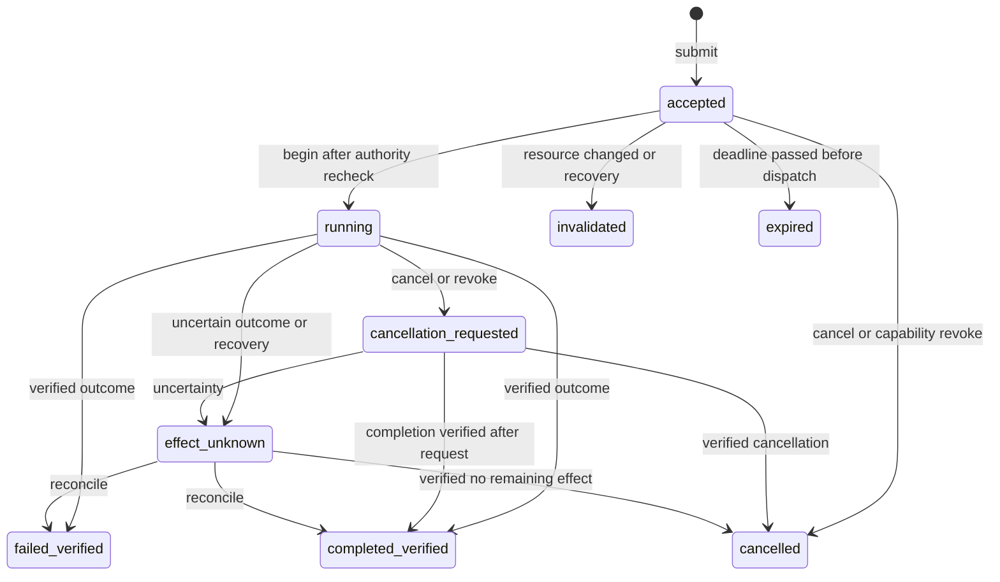

# Native broker contract

The `reflexmesh._native` extension is Rust compiled through PyO3 and the
`setuptools-rust` backend. It contains the authoritative state reducer, dispatch
admission, resource revision checks, logical leases, bounded queues, journal
replay, and calibrated linear and tree policy scorers. It never executes an operating
system effect. The Python host resolves registered resource handles, dispatches
workers, enforces argument schemas and process limits, and verifies outcomes.

## Authority and lifecycle

An action has one immutable registration: ID, version, required capabilities,
write permission, and maximum resource count. Re-registering an identical spec
is harmless; changing a spec under an existing ID fails. Capabilities originate
in the trusted host configuration. Revocation is supported; model output cannot
grant authority through an intent or event field.

A trusted observation creates a resource at revision zero. A different
fingerprint increments its revision and invalidates accepted work referring to
that resource. Identical fingerprints preserve its revision. The host must
derive fingerprints from actual resource state and keep resource IDs bound to
the same canonical path, service or object. A Rust string is not a filesystem
handle and cannot prevent symlink substitution or a concurrent external writer.

`submit` validates registration, version, capability presence, resource scope,
expected revisions, deadline, and conflicting leases. Shared reads are allowed;
a write conflicts with every other active access to the same resource. `begin`
rechecks the same authority and revisions immediately before dispatch and
returns the admitted arguments from the stored intent. It permits exactly one
admission for that intent in this broker history. Direct execution must use
this entry point too.



Running, cancellation-requested, and unknown effects retain leases. A timeout
is not proof that a remote effect stopped. The host must independently enforce
I/O deadlines and reconcile actual state. Only unstarted accepted work expires
automatically. Cancellation requests do not roll back writes. A completed
outcome may be valid after cancellation was requested if the external effect
had already occurred.

The outcome must include a nonempty evidence object. Changes may name only the
intent's declared write resources. A verified change increments the relevant
revision once. Include its new fingerprint to avoid an extra conservative
increment on the next observation. The broker validates the receipt's structure
and scope; the trusted host verifier establishes whether its content is true.

## JSON boundary

Every method returning structured data returns JSON text. Errors are
`BrokerError` (`RuntimeError`) containing `code: detail`. JSON is decoded into
typed Rust structs. Unknown contract fields, enum values, nonfinite JSON
numbers, malformed identifiers, excessive payload sizes, and invalid
transitions fail before mutation. Caller-supplied dispatch clocks are not
accepted. The broker uses `Instant`; replay alone consumes recorded ticks.

```python
import json
from reflexmesh._native import Broker

j = json.dumps
broker = Broker(j({"capabilities": ["files.write"]}))
broker.register_action(j({
    "action_id": "write_text.v1", "version": 1,
    "required_capabilities": ["files.write"],
    "allow_write": True, "max_resources": 1,
}))
broker.observe(j({
    "event_id": "observe-1", "source_id": "runtime", "source_sequence": 1,
    "kind": "resource_observed", "resource_id": "file:registered-note",
    "fingerprint": "sha256:actual-before-state",
}))
broker.submit(j({
    "intent_id": "write-1", "action_id": "write_text.v1",
    "idempotency_key": "user-operation-1", "ttl_ms": 30000,
    "resources": [{"resource_id": "file:registered-note",
                   "expected_revision": 0, "access": "write"}],
    "arguments": {"resource_id": "file:registered-note", "text": "hello"},
}))
admission = json.loads(broker.begin("write-1"))
# Trusted host dispatches admission["arguments"] and verifies actual state here.
# Do not report the illustrative receipt below without performing that check.
broker.finish("write-1", j({
    "status": "completed_verified", "changed_resources": ["file:registered-note"],
    "resource_fingerprints": {"file:registered-note": "sha256:actual-after-state"},
    "evidence": {"verifier": "actual-file-content-check", "matches_expected": True},
}))
```

| Method | Result or behavior |
| --- | --- |
| `Broker(config_json="{}")` | Creates a workspace with fixed initial capabilities and trusted source IDs. |
| `register_action(spec_json)` | Registered immutable action spec. |
| `observe(event_json)` | Duplicate flag, global observation revision, gap flag and reducer result. |
| `submit(intent_json)` | `{duplicate, record}`; idempotency aliases return the original intent record. |
| `begin(intent_id)` | `{admitted, record, action_spec, arguments}`. |
| `finish(intent_id, outcome_json)` | Stored intent record after an in-flight outcome. |
| `reconcile(intent_id, outcome_json)` | Stored record after verifying an unknown or cancellation-requested effect. |
| `cancel(intent_id)` | Current record; in-flight requests retain their lease. |
| `revoke(capability)` | Revocation flag and affected intents. |
| `expire()` | IDs of expired unstarted intents. |
| `enqueue(event_json, control=False)` | Queue class and depth; bounded admission. |
| `drain(limit=1)` | At most 64 reducer results, control events first; rejected events have explicit errors. |
| `snapshot()` | Schema, workspace, revisions, journal position and complete state. |
| `journal()` | Checkpoint plus subsequent typed commands and chain digests. |
| `checkpoint(acknowledged_tip)` | New checkpoint digest; requires exact current tip. |
| `Broker.replay(journal_json)` | Deterministically reconstructed snapshot; cannot execute effects. |
| `Broker.from_journal(journal_json)` | Recovered broker: accepted work invalidates; in-flight work becomes unknown. |
| `now_ms()` | Monotonic milliseconds since this broker's time origin plus recovered offset. |

`intent_id` and action-scoped `idempotency_key` are checked against the complete
workspace ledger. Matching duplicates return the existing record, even if
terminal. A changed operation under the same ID or key fails. A successful
`begin` cannot be repeated. This is at-most-one admission in the recorded
broker history, not an exactly-once distributed execution guarantee. External
services should also accept stable idempotency keys.

## Queues and bounded state

Default capacities are 256 normal events, 32 control events, 4096 resources,
4096 intent records, 65536 event deduplication records, 100000 journal entries,
and 65536 bytes per command. They are explicit configuration limits; exhaustion
returns an error. The host must observe and handle backpressure rather than
silently drop or resubmit actions. Terminal records and deduplication entries
are retained. Checkpointing compacts the command log, not those safety ledgers;
long-lived services need an explicit workspace rotation and durable history
policy before ledger limits are reached.

Control events are cancellation and capability revocation. Their separate
capacity cannot be consumed by normal observations. A drain services control
first and is limited to 64 events. An event ID is idempotent only for the same
canonical payload. Source sequences must increase; gaps are surfaced. Use
separate trusted source IDs for control and normal event streams when queue
priority could reorder one source's sequence. Otherwise earlier normal events
may correctly become stale and appear as dead letters.

This is a serialized mutex-protected reducer. Rust work releases the Python
GIL. One transition clones bounded state before committing, and lease checks
scan active intents. State size, queued work, serialization, the OS scheduler,
and mutex contention therefore affect admission latency. Control priority is
an ordering property, not a hard real-time cancellation bound or starvation
proof. The host must keep blocking I/O and model inference outside broker
operations. Benchmark cold and warm p50/p95/p99 at documented state sizes;
report queue delay, decision time, admission, effect completion, deadline
misses, and outcome success separately.

## Persistence, replay and recovery

Successful state transitions append a SHA-256 chain entry containing its
sequence, monotonic tick, previous hash, typed command, and result digest.
Rejected transitions are atomic and do not mutate the state or append a
successful command. Pure no-ops need no new entry. The host should log rejected
requests separately if required for audit.

The chain detects accidental alteration relative to a trusted checkpoint/tip.
It is not a signature, encryption, proof of external effects, or protection
against an attacker who can rewrite the whole journal and its trusted anchor.
`journal()` is an in-memory export; the host is responsible for durable storage,
flush/fsync semantics, access control, retention and external anchoring.

Persist an admission before issuing a non-idempotent external effect. Persist
verified receipts after effects. If a crash occurs in that window, recovery
must treat the effect as unknown and query actual state. `from_journal` performs
exactly that conservative transition for recorded in-flight intents, clears
transient queues, and never invokes an effector. If the host dispatches before
persisting admission, a lost record can defeat local duplicate suppression.

Checkpoint protocol: persist the current journal, then pass its exact tip to
`checkpoint`, then persist the newly exported checkpoint journal. Keep the
previous durable journal until the replacement is durable. Concurrent changes
make the old tip fail the acknowledgement check. The broker cannot itself
verify that the host persisted anything.

Journal admission reserves `3 * active_intents + 16` entries for outcomes and
control transitions. At the hard limit further mutations fail until a trusted
checkpoint acknowledgement. This reserve is backpressure mitigation, not an
unbounded guarantee against control storms. Persistence/checkpoint scheduling
is a required host responsibility.

## Policy scoring and security boundary

`score_linear(export_json, features_json)` evaluates an exported linear model
and Platt calibration in Rust. For feature vector `x`, its result is
`sigmoid(cal_coef * (dot(coef, x) + intercept) + cal_intercept)`. Inputs require
matching dimensions and finite values. Each result is a calibrated score from
the supplied model; calibration quality depends on held-out evidence.
Scores never grant capabilities or bypass admission. Parsing the model on
each invocation is included in that API's cost; it is not a cached inference
session. `score_trees` evaluates the canonical exported tree ensemble with
float32 features, split comparisons and margin accumulation, followed by
float64 Platt calibration. It validates contiguous node IDs, forward child
edges, unique parents, finite thresholds/leaves and model size bounds.

`LinearScorer(export_json)` and `TreeScorer(export_json)` retain immutable,
validated models. Their `score(features_json)` method returns JSON probabilities.
For repeated inference, `score_f32(features_le_bytes, row_count)` accepts
row-major little-endian float32 bytes and returns a probability list. It checks
the exact byte length, finite values and row limits before scoring; no buffer
alignment assumptions or unsafe pointer casts are used. `feature_names` exposes
the expected ordered feature schema. Both release the GIL during scoring and
can be shared across caller threads. Scoring still grants no authority.

`python -m reflexmesh.benchmarks.native_parity` compares actual fitted Python
and compiled native exports, including representable values immediately below,
at and above every unique tree split. Its warmed comparison reports candidate
count, iterations, cold construction, and p50/p95/p99 separately. These narrow
kernel measurements exclude shared feature construction, queueing and effects;
they are not end-to-end task latency claims.

The extension does not isolate untrusted Python in the same process. Trusted
source names are routing labels, not cryptographic authentication. A caller
with unrestricted broker references can register actions or manufacture
observations within configured capabilities. Keep those references in the
trusted service; agents receive a constrained transport instead. Types and
capability strings alone are not an operating-system sandbox.

On Windows, process Job Objects can help bound and terminate process trees;
they do not restrict arbitrary filesystem/network access. Strong hostile-code
isolation needs an appropriately configured AppContainer, VM or other boundary.
The host must bind paths safely, use argument vectors without shell expansion,
bound output, avoid ambient credentials, enforce network policy, and verify
the actual effect. Path rechecks narrow but do not eliminate TOCTOU races with
external writers; OS handle-based operations or stronger isolation are needed
for that threat model.

Official references: [PyO3 parallelism](https://pyo3.rs/v0.27.2/parallelism.html),
[setuptools-rust](https://setuptools-rust.readthedocs.io/en/latest/),
[Windows Job Objects](https://learn.microsoft.com/en-us/windows/win32/procthread/job-objects),
[AppContainer isolation](https://learn.microsoft.com/en-us/windows/win32/secauthz/appcontainer-isolation).
